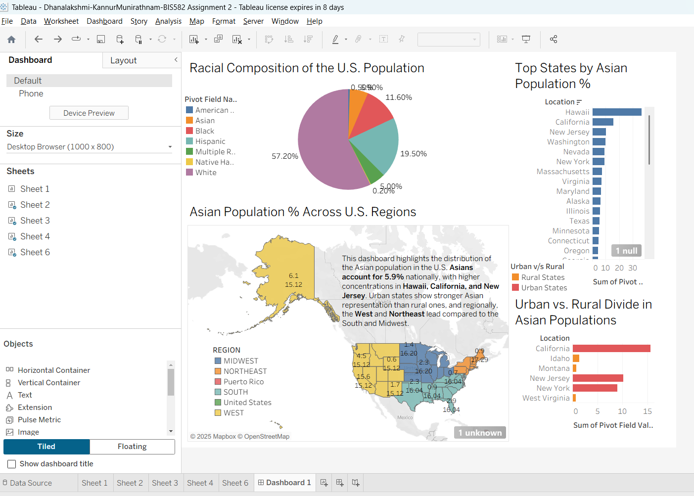

# U.S. Population by Race and Asian Population Distribution

**Author:** Dhanalakshmi Kannur Munirathnam  
**Course:** BIS 582 – Data Visualization (Central Michigan University)  
**Tool:** Tableau  
**Dataset:** U.S. Census Bureau – Population by Race and Region  

---

## 📊 Overview
This dashboard analyzes the **racial composition of the U.S. population** with a focus on **Asian population distribution** across states and regions.

## 🎯 Key Insights
- Asians represent **5.9 %** of the U.S. population, concentrated in **Hawaii, California, and New Jersey**.  
- **Urban states** show higher Asian representation than rural ones.  
- The **West and Northeast** lead regionally, compared to the South and Midwest.

## 🗺️ Dashboard Components
1. **Racial Composition Pie Chart** – shares among racial groups.  
2. **Regional Map** – Asian population % across U.S. regions.  
3. **Top States Bar Chart** – states ranked by Asian population %.  
4. **Urban vs Rural Analysis** – urban/rural comparison by state.

## 🧠 Techniques Used
- Calculated fields for percentage distribution  
- Geographic mapping using OpenStreetMap  
- Containers for layout (Desktop 1000×800)  
- Color encoding for regions and urban/rural states  

## 🌐 View Interactive Dashboard
[View on Tableau Public →](https://public.tableau.com/views/Dhanalakshmi-KannurMunirathnam-BIS582Assignment2/Dashboard1?:language=en-US&publish=yes)

## 📷 Preview

---

## 💡 Reflection
This project improved my ability to use Tableau for **geospatial analysis** and **data storytelling**, emphasizing demographic patterns through maps, color design, and comparative charts.

---

## 📂 Files
- `Dhanalakshmi-KannurMunirathnam-BIS582_Assignment2.twbx` – Tableau workbook  
- `dashboard.png` – dashboard screenshot  
- `raw_data.csv`, `clean_data_.csv` – supporting data files  
